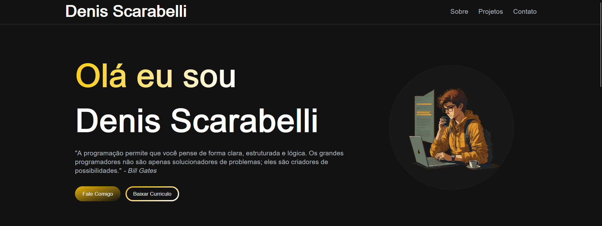

# Site Portfólio Next

Este é o meu site portfolio desenvolvido utilizando Next.js e Tailwind CSS. Aqui, compartilho minha jornada, projetos e habilidades como desenvolvedor.

## Tecnologias Utilizadas

- [Next.js](https://nextjs.org/)
- [Tailwind CSS](https://tailwindcss.com/)
- [Framer Motion](https://www.framer.com/motion/)

## Pré-visualização



## Instalação

1. Clone o repositório:

    ```bash
    git clone https://github.com/seu-usuario/nome-do-repositorio.git
    ```

2. Instale as dependências:

    ```bash
    cd nome-do-repositorio
    npm install
    ```

3. Inicie o servidor de desenvolvimento:

    ```bash
    npm run dev
    ```
